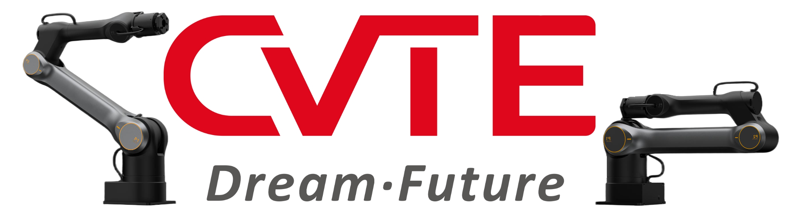

# arm_control_sdk软件安装与使用指南

---

## 目录

- [arm\_control\_sdk软件安装与使用指南](#arm_control_sdk软件安装与使用指南)
  - [目录](#目录)
  - [简介](#简介)
  - [库相关依赖](#库相关依赖)
  - [C++库声明与使用](#c库声明与使用)
    - [C++库结构](#c库结构)
    - [如何声明sdk环境](#如何声明sdk环境)
      - [Linux](#linux)
      - [Windows](#windows)
    - [编译C++Demo](#编译cdemo)
    - [运行C++入门例程](#运行c入门例程)
    - [C++库接口说明](#c库接口说明)
  - [Python库安装与使用](#python库安装与使用)
    - [如何编译安装卸载环境](#如何编译安装卸载环境)
    - [PythonDemo运行](#pythondemo运行)
  - [ROS环境的使用](#ros环境的使用)
    - [Python ROS节点](#python-ros节点)
    - [C++的ROS编译和节点运行](#c的ros编译和节点运行)
    - [ROSTopic对照表](#rostopic对照表)
  - [常见问题与技术支持](#常见问题与技术支持)
    - [Q\&A](#qa)

## 简介

本功能包是基于与机械臂网络通讯的方式，建立的功能使用接口，包含连接、运动、跟随、设置、获取等多种功能；

详细的产品安装、上位机使用说明和SDK使用说明，以及最新的SDK下载请到如下官方页面下载：

[https://cvte-bot.feishu.cn/wiki/GyGbwKeWMiqEfDk80QXc9zeCnjf](https://cvte-bot.feishu.cn/wiki/GyGbwKeWMiqEfDk80QXc9zeCnjf)

使用接口主要是**carm.CArmSingleCol()**（python接口同名）,是使用单个机械臂套装时使用，在使用双臂套装时候使用**carm.CArmDualBot()**（python接口同名）；

补充说明，单臂是指本体存在且只存在单个机械臂的本体，此时一个控制器控制一个机械臂；双臂是指人型双臂之类两个臂同属于一个整体的情况，此时一个控制器控制两个机械臂。如果使用两个单臂作为双臂，同样使用carm.CArmSingleCol()单臂接口，请修改IP后，以IP来区分两个臂。

Python接口统一使用纯 Python 实现的 `carm` 包（`pip install carm`），基于 WebSocket 协议直接与控制器通讯，安装轻量、跨平台兼容性好，与 C++ 接口签名保持一致。

**环境要求：**

| SDK              | 系统类型                         | 架构类型                        | Python版本              |
| ---------------- | -------------------------------- | ------------------------------- | ----------------------- |
| **C++**    | **✅Linux<br />✅Windows** | **✅x86_64<br />✅arm64** | ❌                      |
| **Python** | **✅Linux<br />✅Windows** | **✅x86_64<br />✅arm64** | **✅Python3.6>=** |

**推荐环境：**

| 芯片架构 | 操作系统             | Python版本   | ros版本  | ros2版本 |
| -------- | -------------------- | ------------ | -------- | -------- |
| ✅x86_64 | ✅Ubuntu 20.04.6 LTS | ✅Python 3.8 | ✅noetic | ✅foxy   |

**本功能包包括模块：**

+ arm_control_sdk.zip：SDK包，包含C++库和Python库，C++无需安装只需声明，python请参考[Python库安装与使用](##Python库安装与使用)
+ carm_ros：ros1消息包，暴露了部分C++库接口为话题， [详细接口含义见ros话题说明](##ROS环境的使用)
+ carm_ros2：ros2消息包，暴露了部分C++库接口为话题， [详细接口含义见ros话题说明](##ROS环境的使用)
+ cpp_test_demo：C++基础调用示例，基础指令运行测试单元， [详细指令见C++指令说明](##C++库安装与使用)
+ python：Python示例目录，包含 `carm` 单臂/双臂主流程示例及 ROS 1 / ROS 2 节点封装

## 库相关依赖

arm_control_sdk 依赖分为内部依赖和第三方库依赖, 所有依赖均会打包，并独立存放，无需另外下载，不污染当前依赖环境，有些外部依赖如果用到可以选择性下载

+ 基础依赖（无需下载）
  1. jsoncpp
+ py依赖（选择性下载）
  1. pip
+ ros依赖（选择性下载）
  1. ros1或者ros2

---

## C++库声明与使用

本功能包以arm_control_sdk.amd64.XXXXXX.zip包的形式安装相关的库(XXXXXX是打包日期)，zip包包括本库的lib，include， python。[使用方法见下文](#如何声明sdk环境)

### C++库结构

```plaintext
arm_control_sdk
├── include
│   └── arm_control_sdk
│       ├── carm_cobot.h
│       ├── carm_dual.h
│       ├── data_type_def.h
│       └── gitlog.txt
├── lib
│   ├── cmake
│   │   └── arm_control_sdk
│   │       ├── arm_control_sdkConfig.cmake
│   │       └── arm_control_sdkConfigVersion.cmake
│   ├── libarm_control_sdk.so
│   ├── libjsoncpp.so.1.7.4
│   ├── libmlog.so
│   └── libterminal_helper.so
├── carm_python
│   ├── carm
│   │   ├── carm_kernel.py
│   │   ├── carm.py
│   │   ├── carm_ros2.py
│   │   ├── carm_scan.py
│   │   └── __init__.py
│   ├── offline_packages
│   │   ├── *.whl
│   ├── pyproject.toml
│   └── README.md
└── setup.bash

32 directories, 946 files
```

### 如何声明sdk环境

#### Linux

+ 1、将zip包解压到arm_control_api下，覆盖旧的库
  ```
  # 来到本工程目录
  cd arm_control_api/
  # 解压C++库
  unzip arm_control_sdk.amd64.XXXXXX.zip
  ```
+ 2、声明环境变量
  ```
  source arm_control_sdk/setup.bash
  ```
+ 3、在自己的工程中声明库（声明的库需要在环境变量声明后才会起效）
  ```
  find_package(arm_control_sdk REQUIRED)             	# 声明sdk库
  add_executable(your_project_note your_project.cpp)   	# 添加你的编译选项
  include_directories(${arm_control_sdk_INCLUDE_DIRS})   	# 添加全局头文件声明
  target_link_libraries(your_project_note PRIVATE ${arm_control_sdk_LIBRARIES})	#添加局部连接库
  ```

#### Windows

Windows 下为预先编译好的库，Windows 下编译配置为 Debug，X64，X86，位于代码仓库 `lib/Windows/`下。可参考如下步骤将 SDK 加入项目的依赖项。

1. 使用 Visual Studio 创建 Debug X64 C++程序
2. 选择项目属性
3. 选择 `C++目录`
4. 设置 `头文件目录`和 `外部库目录`分别为**arm_control_sdk**下的 `include`和 `lib/windows/x64/Debug`

### 编译C++Demo

C++的使用用例在arm_control_api/cpp_test_demo中，下面是主要功能和用法介绍

+ 该例程主要通过简化的界面输入指令，来执行一些示例的函数映射表可见于test_carm_api.cpp最后。
+ 基础指令用于快速测试机器人的接口性能，能够快速利用api搭建测试场景。
+ 使用方法：先输入指令然后回车，按照得到的提示来输入参数再回车，部分接口已经有参数，可以手动更改。
+ 实现自己的函数是可仿照该接口调用形式。

编译例程：

```plaintext
cd ./cpp_test_demo
mkdir build && cd build
cmake ..
make
```

### 运行C++入门例程

运行:

> ./carm_demo

连接:

> c

复位:

> r

切换为MIT模式（可选）：

> cm

设置较慢的速度（可选）：

> le

运动到零位:

> mh

运动到指定关节点位:

> mj

查看运动后机器的关节位置和位姿：

> p

恢复的速度（可选）：

> le

运动到零位:

> mh

运动到指定笛卡尔点位:

> mp

循环测试:

> ct

打开关闭夹爪

> sgg

运行示例的PVT运动轨迹

> pvtj

### C++库接口说明

+ C++库包含所有功能指令，详细的函数定义见arm_control_sdk/include/carm_cobot.h，双臂请见arm_control_sdk/include/carm_dual.h，结构体定义请见arm_control_sdk/include/data_type_def.h
+ 单臂是指独立的单个本体机械臂，双臂是指人型双臂两个臂属于一个整体的情况，如果使用两个单臂，请修改IP后，以IP来区分两个臂
+ 本机械臂基础分为连接管理、基础控制、运动指令、状态获取、末端执行器、运动控制、配置设置、运动学、示教功能，以及回调注册函数。
+ 具体的输入输出接口参数含义请参考arm_control_sdk/include/arm_control_sdk的头文件中的注释

| 单臂接口 (carm_cobot.h)                                                             | 双臂接口 (carm_dual.h)                                                                                                                                                                                                 | 接口作用简述                 |
| ----------------------------------------------------------------------------------- | ---------------------------------------------------------------------------------------------------------------------------------------------------------------------------------------------------------------------- | ---------------------------- |
| **连接管理**                                                                  |                                                                                                                                                                                                                        |                              |
| ✅ CArmSingleCol                                                                    | ✅ CArmDualBot                                                                                                                                                                                                         | 创建机械臂控制对象           |
| ✅ connect()                                                                        | ✅ connect()                                                                                                                                                                                                           | 连接到机械臂控制器           |
| ✅ disconnect()                                                                     | ✅ disconnect()                                                                                                                                                                                                        | 断开与控制器连接             |
| ✅ is_connected()                                                                   | ✅ is_connected()                                                                                                                                                                                                      | 检查连接状态                 |
| **基础控制**                                                                  |                                                                                                                                                                                                                        |                              |
| ✅ set_ready()                                                                      | ✅ set_ready()                                                                                                                                                                                                         | 控制器复位准备               |
| ✅ set_servo_enable()                                                               | ✅ set_servo_enable()                                                                                                                                                                                                  | 伺服使能控制                 |
| ✅ set_control_mode()                                                               | ✅ set_control_mode()                                                                                                                                                                                                  | 设置控制模式                 |
| ✅ emergency_stop()                                                                 | ✅ emergency_stop()                                                                                                                                                                                                    | 紧急停止                     |
| **状态获取**                                                                  |                                                                                                                                                                                                                        |                              |
| ✅ get_version()                                                                    | ✅ get_version()                                                                                                                                                                                                       | 获取控制器版本               |
| ✅ get_config()                                                                     | ✅ get_left_config()/✅ get_right_config()                                                                                                                                                                             | 获取机械臂配置参数           |
| ✅ get_eeff_config()                                                                | ✅ get_left_eeff_config()/✅ get_right_eeff_config()                                                                                                                                                                   | 获取末端执行器配置           |
| ✅ get_status()                                                                     | ✅ get_left_status()/✅ get_right_status()                                                                                                                                                                             | 获取机械臂状态               |
| ✅ get_joint_pos()/vel()/tau()                                                      | ✅ get_left_joint_pos()/vel()/tau()/<br />✅ get_right_joint_pos()/vel()/tau()                                                                                                                                         | 获取关节位置/速度/力矩       |
| ✅ get_cart_pose()                                                                  | ✅ get_left_cart_pose()/<br />✅ get_right_cart_pose()                                                                                                                                                                 | 获取末端位姿                 |
| ✅ get_joint_external_tau()                                                         | ✅ get_left_joint_external_tau()/<br />✅ get_right_joint_external_tau()                                                                                                                                               | 获取关节外力矩               |
| ✅ get_cart_external_force()                                                        | ✅ get_left_cart_external_force()/<br />✅ get_right_cart_external_force()                                                                                                                                             | 获取末端力控外力             |
| ✅ get_plan_joint_pos()/vel()/tau()/cart_pose()                                     | ✅ get_left_plan_joint_pos()/vel()/tau()/cart_pose()<br />✅ get_right_plan_joint_pos()/vel()/tau()/cart_pose()                                                                                                        | 获取规划目标值               |
| **末端执行器**                                                                |                                                                                                                                                                                                                        |                              |
| ✅ get_eeff_state()/pos()/vel()/tau()                                               | ✅ get_left_eeff_state()/pos()/vel()/tau()<br />✅ get_right_eeff_state()/pos()/vel()/tau()                                                                                                                            | 获取末端执行器状态           |
| ✅ get_eeff_type()/dof()/connect()                                                  | ✅ get_left_eeff_type()/dof()/connect()<br />✅ get_right_eeff_type()/dof()/connect()                                                                                                                                  | 获取末端类型/自由度/连接     |
| ✅ get_plan_eeff_pos()/vel()/tau()                                                  | ✅ get_left_plan_eeff_pos()/vel()/tau()<br />✅ get_right_plan_eeff_pos()/vel()/tau()                                                                                                                                  | 获取末端规划目标             |
| ✅ set_eeff()                                                                       | ✅ set_left_eeff()/✅ set_right_eeff()                                                                                                                                                                                 | 控制末端执行器运动           |
| ✅ get_gripper_*()/set_gripper()（deprecated，用 eeff 替代）                        | ✅ get_left/right_gripper_*()/set_left/right_gripper()（deprecated）                                                                                                                                                   | 夹爪控制（已废弃）           |
| ✅ get_hand_*()/set_hand()（deprecated，用 eeff 替代）                              | ✅ get_left/right_hand_*()/set_left/right_hand()（deprecated）                                                                                                                                                         | 灵巧手控制（已废弃）         |
| **运动控制**                                                                  |                                                                                                                                                                                                                        |                              |
| ✅ track_joint()/<br />✅ track_pose()                                              | ✅ track_left_joint()/<br />✅ track_right_joint()/<br />✅ track_left_pose()/<br />✅ track_right_pose()                                                                                                              | 实时跟随运动                 |
| ✅ move_joint()/<br />✅ move_pose()                                                | ✅ move_left_joint()/<br />✅ move_right_joint()/<br />✅ move_left_pose()/<br />✅ move_right_pose()                                                                                                                  | 关节空间点到点运动           |
| ✅ move_line_joint()/<br />✅ move_line_pose()                                      | ❌（已从 C++ 头文件中移除）                                                                                                                                                                                            | 直线运动                     |
| ✅ move_joint_traj()/<br />✅ move_pose_traj()                                      | ✅ move_left_joint_traj()/<br />✅ move_right_joint_traj()/<br />✅ move_left_pose_traj()/<br />✅ move_right_pose_traj()                                                                                              | 轨迹运动<br />时间最优规划   |
| **配置设置**                                                                  |                                                                                                                                                                                                                        |                              |
| ✅ set_speed_level()                                                                | ✅ set_speed_level()                                                                                                                                                                                                   | 设置速度等级                 |
| ✅ set_tool_index()                                                                 | ✅ set_left_tool_index()/<br />✅ set_right_tool_index()                                                                                                                                                               | 设置工具号                   |
| ✅ get_tool_index()                                                                 | ✅ get_left_tool_index()/<br />✅ get_right_tool_index()                                                                                                                                                               | 获取工具号                   |
| ✅ get_tool_coordinate()                                                            | ✅ get_left_tool_coordinate()/<br />✅ get_right_tool_coordinate()                                                                                                                                                     | 获取工具坐标系               |
| ✅ set_collision_config()                                                           | ✅ set_collision_config()                                                                                                                                                                                              | 设置碰撞检测                 |
| **运动学**                                                                    |                                                                                                                                                                                                                        |                              |
| ✅ inverse_kine()/forward_kine()/<br />✅ inverse_kine_array()/forward_kine_array() | ✅ inverse_kine_left()/forward_kine_left()<br />✅ inverse_kine_right()/forward_kine_right()<br />✅ inverse_kine_left_array()/forward_kine_left_array()<br />✅ inverse_kine_right_array()/forward_kine_right_array() | 正逆运动学计算               |
| **示教功能**                                                                  |                                                                                                                                                                                                                        |                              |
| ✅ trajectory_teach()/<br />✅ trajectory_recorder()/<br />✅ check_teach()         | ✅ trajectory_teach_left()/right()<br />✅ trajectory_recorder_left()/right()<br />✅ check_teach()                                                                                                                    | 示教轨迹录制/回放            |
| **回调注册**                                                                  |                                                                                                                                                                                                                        |                              |
| ✅ register_error_cbk()                                                             | ✅ register_error_cbk()                                                                                                                                                                                                | 注册错误                     |
| ✅ register_completion_cbk()                                                        | ✅ register_completion_cbk()                                                                                                                                                                                           | 完成回调                     |
| ✅ register_joint_cbk()                                                             | ✅ register_left_joint_cbk()/<br />✅ register_right_joint_cbk()                                                                                                                                                       | 获取带时间戳的关节数据       |
| ✅ register_pose_cbk()                                                              | ✅ register_left_pose_cbk()/<br />✅ register_right_pose_cbk()                                                                                                                                                         | 获取带时间戳的末端数据       |
| ✅ register_external_force_cbk()                                                    | ✅ register_left_external_force_cbk()/<br />✅ register_right_external_force_cbk()                                                                                                                                     | 获取带时间戳的外力矩数据     |
| ✅ register_plan_joint_cbk()                                                        | ✅ register_left_plan_joint_cbk()/<br />✅ register_right_plan_joint_cbk()                                                                                                                                             | 获取带时间戳的关节控制数据   |
| ✅ register_plan_pose_cbk()                                                         | ✅ register_left_plan_pose_cbk()/<br />✅ register_right_plan_pose_cbk()                                                                                                                                               | 获取带时间戳的笛卡尔控制数据 |

---

## Python库安装与使用

Python SDK 统一使用 `carm` 包（纯 Python 实现，基于 WebSocket 协议），与 C++ 接口完全对齐。

`carm` 提供两层接口：

+ `CArmSingleCol`（`carm.py`）：六轴单臂包装类，方法签名与返回值与 C++ `CArmSingleCol`（`carm_cobot.h`）完全对齐
+ `CArmDualBot`（`carm.py`）：七轴人形双臂包装类，方法签名与返回值与 C++ `CArmDualBot`（`carm_dual.h`）完全对齐
+ `Carm`（`carm_kernel.py`）：底层 WebSocket 内核，供上层包装类调用，一般不直接使用

> **注意**：`carm_py`（pybind 封装）已从 SDK 中移除（v1.0.1 起）。请使用 `carm` 替代。

### 安装与卸载

* 在线安装：

  ```
  pip install carm
  ```
* 离线安装：

  ```
  cd arm_control_sdk/carm_python/
  # 离线安装三方依赖库
  pip install arm_control_sdk/carm_python/offline_packages/*.whl
  # 安装 carm 库
  pip install .
  ```
* 卸载：

  ```
  pip uninstall carm
  ```
* 使用示例：

  ```python
  from carm import CArmSingleCol

  # 六轴单臂
  arm = CArmSingleCol("10.42.0.101")
  arm.connect()
  arm.set_ready()
  arm.move_joint([0, 0, 0, 0, 0, 0])  # 返回 1 成功 / -1 失败
  arm.disconnect()

  from carm import CArmDualBot

  # 七轴人形双臂
  dual = CArmDualBot("10.42.0.101")
  dual.connect()
  dual.set_ready()
  dual.move_left_joint([0, 0, 0, 0, 0, 0, 0])
  dual.move_right_joint([0, 0, 0, 0, 0, 0, 0])
  dual.disconnect()
  ```

### carm接口说明

`CArmSingleCol` / `CArmDualBot` 接口完全对齐 C++ `carm_cobot.h` / `carm_dual.h`，命令类方法返回 `int`（`1` 成功 / `-1` 失败），查询类方法返回对应数据类型。

| 单臂接口 (CArmSingleCol)                                                | 双臂接口 (CArmDualBot)                                                                                                                           | 接口作用简述               |
| ----------------------------------------------------------------------- | ------------------------------------------------------------------------------------------------------------------------------------------------ | -------------------------- |
| **连接管理**                                                      |                                                                                                                                                  |                            |
| ✅ connect()/disconnect()/is_connected()                                | ✅ connect()/disconnect()/is_connected()                                                                                                         | 连接与断开机械臂控制器     |
| **基础控制**                                                      |                                                                                                                                                  |                            |
| ✅ set_ready()/set_servo_enable()/set_control_mode()                    | ✅ set_ready()/set_servo_enable()/set_control_mode()                                                                                             | 控制器准备、伺服使能、模式 |
| ✅ emergency_stop()/task_stop()                                         | ✅ emergency_stop()/task_stop()                                                                                                                  | 急停与任务停止             |
| ✅ set_debug()                                                          | ✅ set_debug()                                                                                                                                   | 设置调试模式               |
| ✅ set_passthrough_data()                                               | ✅ set_passthrough_data()                                                                                                                        | CAN 透传收发               |
| **状态获取**                                                      |                                                                                                                                                  |                            |
| ✅ get_version()/get_config()/get_eeff_config()/get_status()            | ✅ get_version()/get_left_right_config()/get_left_right_eeff_config()/get_left_right_status()                                                    | 版本、关节/末端配置与状态  |
| ✅ get_joint_pos()/vel()/tau()                                          | ✅ get_left_right_joint_pos()/vel()/tau()                                                                                                        | 实际关节位置/速度/力矩     |
| ✅ get_plan_joint_pos()/vel()/tau()                                     | ✅ get_left_right_plan_joint_pos()/vel()/tau()                                                                                                   | 规划关节位置/速度/力矩     |
| ✅ get_cart_pose()/get_plan_cart_pose()                                 | ✅ get_left_right_cart_pose()/get_left_right_plan_cart_pose()                                                                                    | 实际/规划末端位姿          |
| ✅ get_joint_external_tau()/get_cart_external_force()                   | ✅ get_left_right_joint_external_tau()/get_left_right_cart_external_force()                                                                      | 关节外力矩/末端外力        |
| **末端执行器**                                                    |                                                                                                                                                  |                            |
| ✅ get_eeff_state()/pos()/vel()/tau()                                   | ✅ get_left_right_eeff_state()/pos()/vel()/tau()                                                                                                 | 通用末端执行器状态         |
| ✅ get_plan_eeff_pos()/vel()/tau()                                      | ✅ get_left_right_plan_eeff_pos()/vel()/tau()                                                                                                    | 规划末端执行器状态         |
| ✅ get_eeff_type()/dof()/connect()                                      | ✅ get_left_right_eeff_type()/dof()/connect()                                                                                                    | 末端类型/自由度/连接状态   |
| ✅ set_eeff()                                                           | ✅ set_left_right_eeff()                                                                                                                         | 通用末端执行器控制         |
| ✅ get_gripper_state()/pos()/tau()/set_gripper()（deprecated）          | ✅ get_left_right_gripper_state()/pos()/tau()/set_left_right_gripper()（deprecated）                                                             | 夹爪控制（已废弃）         |
| ✅ get_hand_state()/pos()/vel()/tau()/set_hand()（deprecated）          | ✅ get_left_right_hand_state()/pos()/vel()/tau()/set_left_right_hand()（deprecated）                                                             | 灵巧手控制（已废弃）       |
| **运动控制**                                                      |                                                                                                                                                  |                            |
| ✅ track_joint()/track_pose()                                           | ✅ track_left_right_joint()/track_left_right_pose()                                                                                              | 实时跟随运动               |
| ✅ move_joint()/move_pose()                                             | ✅ move_left_right_joint()/move_left_right_pose()                                                                                                | 关节空间点到点运动         |
| ✅ move_line_joint()/move_line_pose()                                   | ❌（已从 C++ 头文件中移除）                                                                                                                      | 直线运动                   |
| ✅ move_joint_traj()/move_pose_traj()                                   | ✅ move_left_right_joint_traj()/move_left_right_pose_traj()                                                                                      | 轨迹运动（时间最优规划）   |
| ✅ move_flow_pose()                                                     | ✅ move_left_right_flow_pose()                                                                                                                   | 笛卡尔雅可比迭代           |
| **配置设置**                                                      |                                                                                                                                                  |                            |
| ✅ set_speed_level()                                                    | ✅ set_speed_level()                                                                                                                             | 设置速度等级               |
| ✅ set_tool_index()/get_tool_index()/get_tool_coordinate()              | ✅ set_left_right_tool_index()/get_left_right_tool_index()/get_left_right_tool_coordinate()                                                      | 工具号与工具坐标系         |
| ✅ set_collision_config()                                               | ✅ set_collision_config()                                                                                                                        | 碰撞检测设置               |
| **运动学**                                                        |                                                                                                                                                  |                            |
| ✅ inverse_kine()/forward_kine()                                        | ✅ inverse_kine_left()/forward_kine_left()/``✅ inverse_kine_right()/forward_kine_right()                                                 | 正逆运动学计算             |
| ✅ inverse_kine_array()/forward_kine_array()                            | ✅ inverse_kine_left_array()/forward_kine_left_array()/``✅ inverse_kine_right_array()/forward_kine_right_array()                         | 批量正逆运动学             |
| **示教功能**                                                      |                                                                                                                                                  |                            |
| ✅ trajectory_teach()/trajectory_recorder()/check_teach()               | ✅ trajectory_teach_left()/trajectory_recorder_left()/``✅ trajectory_teach_right()/trajectory_recorder_right()/``✅ check_teach() | 示教轨迹录制/回放          |
| **回调注册**                                                      |                                                                                                                                                  |                            |
| ✅ register_error_cbk()/register_completion_cbk()                       | ✅ register_error_cbk()/register_completion_cbk()                                                                                                | 错误与任务完成回调         |
| ✅ register_joint_cbk()/register_pose_cbk()                             | ✅ register_left_right_joint_cbk()/register_left_right_pose_cbk()                                                                                | 关节/末端数据回调          |
| ✅ register_plan_joint_cbk()/register_plan_pose_cbk()                   | ✅ register_left_right_plan_joint_cbk()/register_left_right_plan_pose_cbk()                                                                      | 规划数据回调               |
| ✅ register_external_force_cbk()                                        | ✅ register_left_right_external_force_cbk()                                                                                                      | 外力数据回调               |
| **底层透传**                                                      |                                                                                                                                                  |                            |
| ✅ set_low_mode()/low_pv_command()/low_mit_command()                    | ✅ set_low_mode()/low_left_right_pv_command()/low_left_right_mit_command()                                                                       | 底层控制指令               |
| ✅ low_pf_command()/low_current_command()/low_refresh()                 | ✅ low_left_right_pf_command()/low_left_right_current_command()/low_left_right_refresh()                                                         | 底层控制指令               |
| ✅ low_set_end_effector_ctr()/low_set_robot_mode()                      | ✅ low_left_right_set_end_effector_ctr()/low_left_right_set_robot_mode()                                                                         | 底层末端/模式指令          |
| ✅ low_set_end_effector_mode()/low_set_servo_enable()/low_reset()       | ✅ low_left_right_set_end_effector_mode()/low_left_right_set_servo_enable()/low_left_right_reset()                                               | 底层末端模式/伺服/复位     |
| ✅ low_get_servo_status()/low_get_inverse_kine()/low_get_forward_kine() | ✅ low_left_right_get_servo_status()/low_left_right_get_inverse_kine()/low_left_right_get_forward_kine()                                         | 底层状态/运动学查询        |
| ✅ low_get_dynamics()/low_get_jacobian()/low_get_nullspace()            | ✅ low_left_right_get_dynamics()/low_left_right_get_jacobian()/low_left_right_get_nullspace()                                                    | 底层动力学/雅可比/零空间   |

### PythonDemo运行

python 示例中包括：

+ `carm_demo.py`：`CArmSingleCol` 六轴单臂主流程示例（推荐优先参考）
+ `carm_dual_bot_demo.py`：`CArmDualBot` 七轴人形双臂主流程示例
+ `carm_ros.py` / `carm_ros2.py`：基于 `CArmSingleCol` 的单臂 ROS 1 / ROS 2 话题封装节点
+ `carm_dual_ros.py` / `carm_dual_ros2.py`：基于 `CArmDualBot` 的双臂 ROS 1 / ROS 2 话题封装节点
+ `carm_bot_demo.py`：单臂图形界面示例

推荐先运行单臂示例：

```plaintext
python3 ./python/carm_demo.py
```

---

## ROS环境的使用

本项目提供 C++ 和 Python 两套 ROS 话题封装，分别支持 ROS 1 和 ROS 2。运行任一节点前均需安装对应的基础 ROS 环境；C++ 节点还需要完成 C++ SDK 环境配置。

### Python ROS节点

本项目提供四个基于 Python 的 ROS 话题封装节点，将 `CArmSingleCol` 与 `CArmDualBot` 的常用控制和状态回调映射为标准 ROS 话题：

| 机械臂类型 | ROS 1 (`rospy`) | ROS 2 (`rclpy`) |
| --- | --- | --- |
| 单臂 | `carm_ros.py` | `carm_ros2.py` |
| 双臂 | `carm_dual_ros.py` | `carm_dual_ros2.py` |

运行前请安装对应 ROS 发行版并 source 环境。ROS 1 示例以 Noetic 为例，ROS 2 示例以 Foxy 为例。所有脚本默认使用 IP `10.42.0.101`、不启动图形界面，并在初始化后连接设备、注册状态回调和执行 `set_ready()`。

```bash
# ROS 1 单臂
cd ./python
source /opt/ros/noetic/setup.bash
python3 carm_ros.py --ip 192.168.1.10 --arm_index 0

# ROS 2 双臂
cd ./python
source /opt/ros/foxy/setup.bash
python3 carm_dual_ros2.py --ip 192.168.1.10
```

单臂脚本支持 `--arm_index`，默认值为 `0`。四个脚本均支持 `--ip <地址>` 指定初始设备 IP；可加 `--gui` 启动 Tkinter 操作界面：

```bash
python3 carm_ros2.py --gui --ip 192.168.1.10 --arm_index 0
python3 carm_dual_ros.py --gui --ip 192.168.1.10
```

使用 `--gui` 时，界面可连接或断开设备、显示连接状态，并可重建为自定义名称的话题。单臂的 `arm_index` 仅由启动参数指定，界面不显示该项。未使用 `--gui` 时不提供上述修改和重连功能，且不会创建 `connect` 订阅话题。

#### 默认话题

单臂节点发布 `real_joint_state` (`sensor_msgs/JointState`)、`flange_cart_state` (`geometry_msgs/PoseStamped`)、`arm_state` (`std_msgs/Int16MultiArray`)、`task_completion` (`std_msgs/String`) 和 `carm_error` (`std_msgs/String`)；订阅 `ready`、`emergency_stop`、`set_servo_enable` (`std_msgs/Bool`)，`set_speed_level`、`set_collision_config` (`std_msgs/Int16MultiArray`)，`set_control_mode` (`std_msgs/Int8`)，`move_joint`、`move_line_joint`、`move_tracking_joint`、`set_eeff` (`sensor_msgs/JointState`)，以及 `move_pose`、`move_line_pose`、`move_tracking_pose` (`geometry_msgs/Pose`)。仅 GUI 模式额外订阅 `connect` (`std_msgs/String`)。

双臂节点保留 `ready`、`emergency_stop`、`set_speed_level`、`set_servo_enable`、`set_collision_config`、`set_control_mode`、`task_completion` 和 `carm_error` 等公共话题；运动、末端执行器和状态话题按左右臂拆分：`left_move_joint` / `right_move_joint`、`left_move_pose` / `right_move_pose`、`left_move_tracking_joint` / `right_move_tracking_joint`、`left_move_tracking_pose` / `right_move_tracking_pose`、`left_set_eeff` / `right_set_eeff`，以及 `left_real_joint_state` / `right_real_joint_state`、`left_flange_cart_state` / `right_flange_cart_state`、`left_arm_state` / `right_arm_state`。GUI 模式同样额外订阅 `connect` (`std_msgs/String`)。

例如，向 ROS 2 单臂节点发送关节运动指令并查看法兰位姿：

```bash
source /opt/ros/foxy/setup.bash
ros2 topic pub --once /move_joint sensor_msgs/msg/JointState "{name: ['joint1', 'joint2', 'joint3', 'joint4', 'joint5', 'joint6'], position: [0.0, 0.0, 0.0, 0.0, 0.0, 0.0], velocity: [], effort: []}"
ros2 topic echo /flange_cart_state
```

### C++的ROS编译和节点运行

+ ros1环境编译和运行

  + 运行ros主节点

  ```plaintext
  # 新开一个窗口1
  cd ./carm_ros
  source /opt/ros/noetic/setup.bash 
  catkin_make
  source devel/setup.bash 

  # 新开一个窗口2
  source /opt/ros/noetic/setup.bash 
  roscore

  # 回到窗口1
  rosrun carm_api carm_ros_node
  ```

  + 发送一个角度移动指令

  ```plaintext
  # 新开一个窗口3
  source /opt/ros/noetic/setup.bash 

  # pub发送目标角度
  rostopic pub /move_joint sensor_msgs/JointState "header:
    seq: 0
    stamp: {secs: 0, nsecs: 0}
    frame_id: ''
  name: ['joint_1', 'joint_2', 'joint_3', 'joint_4', 'joint_5', 'joint_6']
  position: [0, 0, 0, 0, 0, 0]
  velocity: [0, 0, 0, 0, 0, 0]
  effort: [0, 0, 0, 0, 0, 0]" -1
  ```

  + 播放之前录制的关节包模拟跟踪的效果

  ```plaintext
  # 新开一个窗口4，用于打开ros1和2的桥
  sudo apt install ros-foxy-ros1-bridge
  source /opt/ros/foxy/setup.bash 
  ros2 run ros1_bridge dynamic_bridge

  # 新开一个窗口5
  source /opt/ros/foxy/setup.bash 
  ros2 bag play rosbag2_2025_07_28-10_57_44(修改为自己的包名字)
  ```
+ ros2环境编译和运行

  + 运行ros主节点

  ```plaintext
  # 新开一个窗口1
  cd ./carm_ros2
  source /opt/ros/foxy/setup.bash 
  colcon build
  source install/setup.bash 
  ros2 run carm_api carm_ros_node
  ```

  + 发送一个角度移动指令

  ```plaintext
  # 新开一个窗口2
  source /opt/ros/foxy/setup.bash 
  ros2 topic pub /move_joint sensor_msgs/msg/JointState "{header: {stamp: {sec: 0, nanosec: 0}, frame_id: ''}, name: ['joint_1', 'joint_2', 'joint_3', 'joint_4', 'joint_5', 'joint_6'], position: [0.0, 0.0, 0.0, 0.0, 0.0, 0.0], velocity: [0.0, 0.0, 0.0, 0.0, 0.0, 0.0], effort: [0.0, 0.0, 0.0, 0.0, 0.0, 0.0]}"
  ```

  + 播放之前录制的关节包模拟跟踪的效果

  ```plaintext
  # 窗口2
  ros2 bag play rosbag2_2025_07_28-10_57_44(修改为自己的包名字)
  ```

### ROSTopic对照表

| topic                | 对应 SDK 接口          | type                                               | 备注                                         |
| -------------------- | ---------------------- | -------------------------------------------------- | -------------------------------------------- |
| connect              | connect()              | **sub：**(String) IP                         | 连接指定 IP 的机器                           |
| ready                | set_ready()            | **sub：**(Bool)                              |                                              |
| emergency_stop       | emergency_stop()       | **sub：**(Bool)                              | 急停后用 ready 恢复机器                      |
| move_joint           | move_joint()           | **sub：**(JointState) 目标关节               | 自带规划，关节移动到目标关节                 |
| move_pose            | move_pose()            | **sub：**(Pose) 目标位姿                     | 自带规划，关节移动到目标位姿                 |
| move_tracking_joint  | track_joint()          | **sub：**(JointState) 跟踪关节               | 用于高频连续接收关节值，并跟踪该关节值       |
| move_tracking_pose   | track_pose()           | **sub：**(Pose) 跟踪末端点                   | 用于高频连续接收末端位姿，并跟踪该末端位姿   |
| set_speed_level      | set_speed_level()      | **sub：**(Int16MultiArray) 速度等级/切换速度 | 速度等级 0~10，变化速度 20                   |
| set_servo_enable     | set_servo_enable()     | **sub：**(Bool) 0 失能/1 使能                | 失能臂会失去动力下砸                         |
| set_collision_config | set_collision_config() | **sub：**(Int16MultiArray) 开关/碰撞等级     | 碰撞等级 0~3，0 最灵敏                       |
| set_eeff             | set_eeff()             | **sub：**(JointState) 末端执行器指令         | position→位置，velocity→速度，effort→力矩 |
| set_control_mode     | set_control_mode()     | **sub：**(Int8) 模式                         | 机器控制模式 0~3                             |
| real_joint_state     | —                     | **pub：**(JointState) 当前关节量             | 持续广播当前关节变量                         |
| flange_cart_state    | —                     | **pub：**(PoseStamped) 末端法兰位姿          | 持续广播当前末端法兰位姿                     |
| arm_state            | —                     | **pub：**(Int16MultiArray) 机器状态          | 持续广播机器状态                             |
| task_completion      | —                     | **pub：**(String) 已完成的任务编号           | 任务完成时广播一帧                           |
| carm_error           | —                     | **pub：**(String) 机器报错信息               | 机器报错时广播一帧                           |

---

## 常见问题与技术支持

  SDK的使用适合二次开发者，简单使用请用上位机。

### Q&A

 **问：关节移动为什么能输入笛卡尔空间参数？**

  答：关节空间移动，是指规划器在关节空间下的规划，而不是指输入的参数一定是关节的位置变量；所以关节空间移动是指规划器在关节空间下规划，关注关节的移动，不能保证末端沿着直线运动；而笛卡尔空间移动的规划，关注机械臂末端在空间上的移动，可以保证末端的直线移动；两个接口均支持输入关节变量和笛卡尔变量。

 **问：关节和空间变量的数组元素分别是什么？**

  答：关节变量含义：[关节1位置，关节2位置，关节3位置，...], 空间变量：[X轴，Y轴，Z轴，四元素X，四元素Y，四元素Z，四元素W]

 **问：跟随和运动指令有什么区别？**

  答：跟随指令相当于透传指令，当需要给机器频繁发送到点指令，希望机器能跟随你的指令移动，则推荐使用跟随模式；运动指令相当于自带规划的指令，当需要让机器自主规划运动，到达某个位置时，则推荐使用运动指令。

 **问：获取机械臂信息的回调函数和直接获取机械臂信息的函数有什么区别？**

  答：因为获取机械臂的信息时需要添加线程锁来保证访问安全，如果高频使用会影响最新机械臂信息的更新同步；所以希望高频获取机械臂状态或者希望获取对应状态的准确时间戳的时候，建议使用回调的方式；当单次访问时，建议直接获取机械臂信息。

**问：当我需要组建双臂的时候是否需要更改SDK接口？**

  答：单臂是指本体存在且只存在单个机械臂的本体，此时一个控制器控制一个机械臂；双臂是指人型双臂之类两个臂同属于一个整体的情况，此时一个控制器控制两个机械臂。

  如果使用两个单臂作为双臂，同样使用carm.CArmSingleCol()单臂接口，请修改IP后，以IP来区分两个臂：

  例如，左臂的IP：10.42.0.101，左臂的IP：10.42.0.102；

  创建左右臂：left_arm_ = carm.CArmSingleCol("10.42.0.101"); right_arm_ = carm.CArmSingleCol("10.42.0.102");
